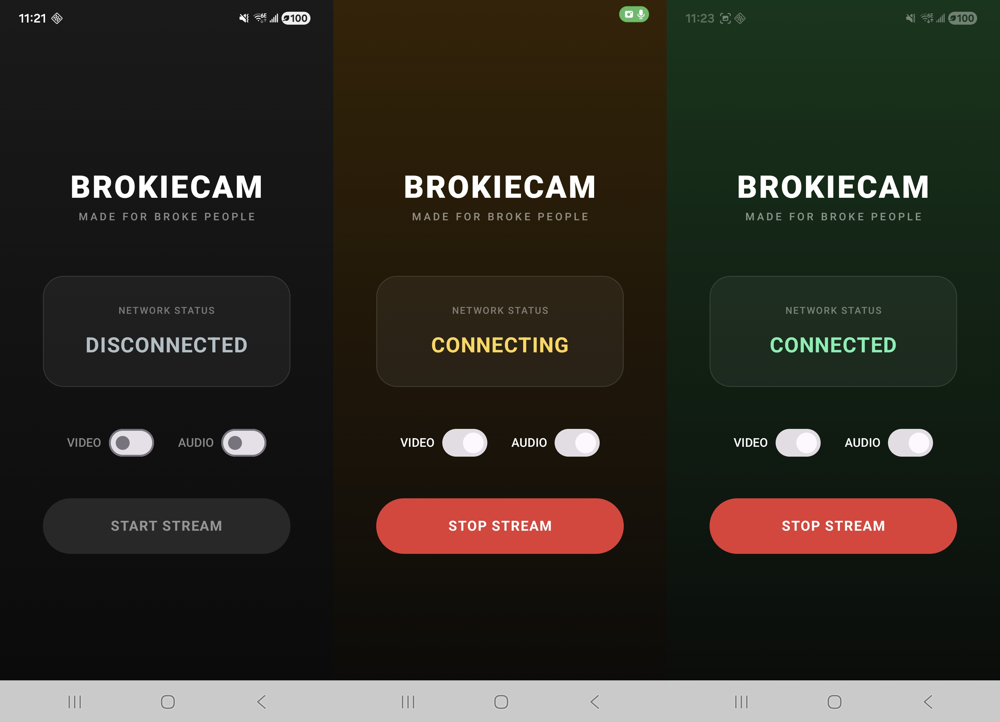

# BrokieCam


## Description

BrokieCam is a lightweight Android app that streams your phone's camera to your Linux computer via USB, creating a virtual webcam device. Perfect for video calls, streaming, or recording when you don't have a dedicated webcam. All processing happens locally, no cloud services.

## Demo

<p align="center">
  
</p>

## Requirements

### Android App
- **OS**: Android 8.0 (API 26) or higher
- **Camera**: Any device with CameraX support
- **USB Debugging**: Enabled in Developer Options

### Computer
- **OS**: Any Linux distro with V4L2 support
- **Node.js**: 18.0 or higher
- **FFmpeg**: Latest version with v4l2loopback support
- **v4l2loopback**: Virtual camera kernel module
- **ADB (Android Debug Bridge)**

---

## How to Run?

### One-Time Setup

**1. Install Dependencies**

```bash
# Ubuntu/Debian
sudo apt update
sudo apt install -y nodejs npm ffmpeg adb v4l2loopback-dkms

# Arch Linux
sudo pacman -S nodejs npm ffmpeg android-tools v4l2loopback-dkms linux-headers

# Fedora
sudo dnf install -y nodejs npm ffmpeg android-tools v4l2loopback
```

**2. Clone and install:**

```bash
git clone https://github.com/FOSSforBrokies/BrokieCam.git
cd BrokieCamDriver
npm install
```

**3. Install Android app:**

- Enable "Install via USB" in Developer Options
- Run the project from Android Studio **OR**
- Download the latest APK from the [Releases](link-to-releases) page (Coming Soon)

**4. Enable Developer Mode:**
1. Go to **Settings** → **About Phone**
2. Tap **Build Number** 7 times
3. Go back to **Settings** → **System** → **Developer Options**
4. Enable **USB Debugging**

### Every Time You Want to Stream

**1. Connect phone to the computer via USB**

**2. Run the launcher script:**

```bash
cd brokiecam/server
./brokiecam.sh
```

The script automatically handles:
- Loading v4l2loopback kernel module (`/dev/video20`)
- Detecting your phone via ADB
- Setting up reverse tunnel (`adb reverse tcp:5000 tcp:5000`)
- Starting the server (TypeScript or JavaScript)

**3. Open BrokieCam app on phone and tap "START USB STREAM"**

**4. Done!** Use `/dev/video20` in Zoom, Discord, OBS, etc

**Expected output:**

```
BrokieCam Launcher
==============================
[*] Virtual camera (/dev/video20) not found.
    Creating it now (Password may be required)... [sudo] password for maxim: 
DONE
[*] Looking for phone... FOUND
[+] Building TCP Bridge... DONE
[+] Starting Video Driver...
   (Press Ctrl+C to stop)
==============================
[OK] BrokieCam Server running on port 5000
[OK] Target: /dev/video20
```

### Quick Test

```bash
# Test the virtual camera
vlc v4l2:///dev/video20
# or
ffplay /dev/video20
```

---

## Architecture

### High-Level System Flow

**Android App**: Captures frames, compresses them to JPEG, and sends them over a local TCP socket.

**ADB Reverse Proxy**: Maps the phone's local port (5000) to the computer's local port over the USB cable.

**Linux Server**: Listens on the desktop port, parses the custom binary protocol, and pipes the raw JPEG frames into FFmpeg, which converts them to a raw video format and writes to v4l2loopback.

**v4l2loopback**: Exposes the stream as a standard /dev/video20 device usable by any Linux application.

### Android App Architecture

**UI Layer**

- **Screen**: A Jetpack Compose UI that displays the live camera feed and connection controls.

- **CameraX Composable**: Binds a `Preview` use case to render to the screen and an `ImageAnalysis` use case to extract and convert raw YUV frames to JPEG on a background thread.

- **View Model**: Bridges the camera and network. It uses a `Channel<CameraFrame>` (capacity 2, drop oldest on overflow) so the camera thread never blocks waiting for a slow network. A single persistent coroutine consumes that channel and forwards to the repository.

**Core Layer**

Decouples the UI from network logic.

- **Model**: Defines core data structures.

- **Repository**: Interfaces for network actions.

**Network Layer**

- **Repository (Implementation)**: Manages a dedicated coroutine scope to process and push frames independently of the UI lifecycle. It delegates all socket work to TCP Streamer.

- **TCP Streamer**: Establishes a thread-safe socket connection to the PC via ADB reverse tunneling and writes frames using a custom binary protocol

- **Binary Protocol**: `[MAGIC_NUMBER (2 bytes BE)] + [LENGTH (4 bytes BE)] + [JPEG DATA (N bytes)]`

### Server

- **TCP Server**: Listens on port 5000 (with `TCP_NODELAY` for low latency)

- **Protocol Decoder**: Buffers and parses the custom binary headers to cleanly extract individual JPEG frames

- **FFmpeg Pipeline**: Spawns an `ffmpeg` process, piping the extracted JPEGs directly to the `v4l2loopback` virtual camera (`/dev/video20`)

---

## Contributing

Contributions are welcome! Please feel free to submit a Pull Request.

## License

This project is licensed under the GPLv2 License - see the [LICENSE](LICENSE) file for details.

---