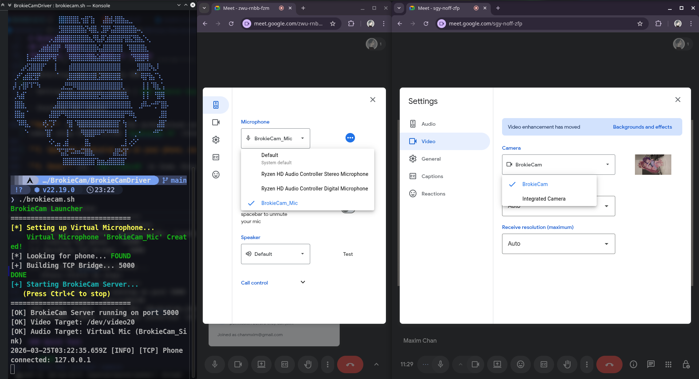

# BrokieCam


## Description

BrokieCam is a lightweight Android app that streams audio and video from your phone's camera and microphone to your Linux computer via USB, creating a virtual webcam and microphone devices. All processing happens locally, no cloud services.

## Demo

<p align="center">
  
  <br>
  <em>BrokieCam Android App Interface</em>
</p>
<p align="center">
  
  <br>
  <em>
  Linux Server Terminal Output and Live Demo in Google Meet
  </em>
</p>


## Requirements

### Android App

- **OS**: Android 8.0 (API 26) or higher

- **Hardware**: Support for CameraX and MediaCodec

- **USB Debugging**: Enabled in Developer Options

### Computer

- **OS**: Any Linux distro with V4L2 support and PulseAudio/PipeWire

- **Tools**: Node.js (18+), FFmpeg, ADB (Android Debug Bridge)

- **Kernel Module**: v4l2loopback (for virtual camera)

## How to Run?

### One-Time Setup

**1. Install Dependencies**

```bash
# Ubuntu/Debian
sudo apt update
sudo apt install -y nodejs npm ffmpeg adb v4l2loopback-dkms

# Arch Linux
sudo pacman -S nodejs npm ffmpeg android-tools v4l2loopback-dkms linux-headers

# Fedora
sudo dnf install -y nodejs npm ffmpeg android-tools v4l2loopback
```

**2. Clone and install:**

```bash
git clone https://github.com/FOSSforBrokies/BrokieCam.git
cd BrokieCam/BrokieCamDriver
npm install
```

**3. Install Android app:**

- Run the project from Android Studio **OR**

- Download the latest APK from the [Releases](https://github.com/FOSSforBrokies/BrokieCam/releases)

**4. Enable Developer Mode:**

1. Go to **Settings** → **About Phone**

2. Tap **Build Number** 7 times

3. Go back to **Settings** → **Developer Options**

4. Enable **USB Debugging**

---

### Every Time You Want to Stream

**1. Connect phone to the computer via USB**

**2. Run the launcher script:**

```bash
cd BrokieCam/BrokieCamDriver
./brokiecam.sh
```

The script automatically handles:

- Creating the PulseAudio Virtual Microphone(`BrokieCam_Mic`)

- Detecting your phone via ADB

- Setting up reverse tunnel (`adb reverse tcp:5000 tcp:5000`)

- Starting the server

***Note**: As mentioned in the architecture section, `v4l2loopback` must be loaded by your kernel, or you must uncomment the virtual camera setup block inside `brokiecam.sh` (lines 58-72)

**3. Open the BrokieCam app on your phone, select your desired pipelines, and tap "START STREAM"**

**4. Done! Use `/dev/video20` and `BrokieCam_Mic` in Zoom, Discord, OBS, etc.**

**Expected output:**

```
BrokieCam Launcher
==============================
[*] Setting up Virtual Microphone...
    Virtual Microphone 'BrokieCam_Mic' Created!
[*] Looking for phone... FOUND
[+] Building TCP Bridge... 5000
DONE
[+] Starting BrokieCam Server...
   (Press Ctrl+C to stop)
==============================
[OK] BrokieCam Server running on port 5000
[OK] Video Target: /dev/video20
[OK] Audio Target: Virtual Mic (BrokieCam_Sink)
[TIMESTAMP] [INFO] [TCP] Phone connected: 127.0.0.1
```

### Quick Test

```bash
# Test the virtual camera
vlc v4l2:///dev/video20
# or
ffplay /dev/video20

# Test the virtual microphone
ffplay -f pulse -i BrokieCam_Mic
```

## Architecture

### High-Level System Flow

- **Android App**: Captures raw audio and video, encodes video via a hardware H.264 encoder, and multiplexes them over a local TCP socket.

- **ADB(Android Debugging Bridge) Reverse Proxy**: Maps the phone's local port (5000) to the computer's local port over the USB cable.

- **Linux Server**: Listens on the desktop port, parses the custom binary protocol, and pipes the A/V payloads into two dedicated FFmpeg processes, which routes the stream into a virtual camera and microphone. It also actively monitors the connection and rebuilds the ADB reverse tunnel if the USB connection drops.

- **Launcher Script**: The launcher script establishes the initial ADB connection, creates an audio sink and a virtual microphone, and starts the linux server. 

***NOTE**: The block of code in the **launcher script** responsible for initializing the virtual camera is **commented out** by default because it requires root (`sudo`) permissions. You can either configure the kernel to load the `v4l2loopback` module automatically during the boot process, or uncomment that specific block of code in the script if you don't mind entering your password when launching.

---

### Android App Architecture

- **Dependency Injection**: Manual dependency injection container `AppContainer` hosted in a custom `Application` class provides centralized lazy initialization for hardware managers, repositories, and ViewModels.

- **UI Layer**

  - **Screen**: A Jetpack Compose UI that manages stream state and toggles for independent video and audio streaming.

  - **View Model**: Bridges the UI to the repository.

- **Core Layer**

  - **Video**: `CameraManager` uses CameraX to draw directly to an input `Surface` provided by `MediaCodec`. `H264Encoder` captures raw frames from `Surface` and outputs encoded H.264 NAL units to a backpressure-aware `Channel`, which is publicly exposed as `videoFrameFlow`. It is configured to drop the oldest data upon the buffer overflow.

  - **Audio**: `MicManager` captures raw uncompressed 16-bit PCM audio directly from the device's microphone via `AudioRecord` and outputs to a backpressure-aware `Channel`, which is publicly exposed as `audioFrameFlow`. It is configured to drop the oldest data upon the buffer overflow.

  - **Pool**: `MediaBufferPool` provides a thread-safe object pool that pre-allocates a fixed number of reusable byte arrays upon app initialization. It is used to temporarily store audio and video frames in the `videoFrameFlow` and `audioFrameFlow`, eliminating continuous memory allocation and alleviating the pressure on the Garbage Collector.

  - **Repository**: Defines interfaces for network actions.

- **Network Layer**

  - **TCP Streamer**: `TcpFrameStreamer` establishes a thread-safe, auto-healing TCP socket connection using an exponential backoff strategy. It multiplexes video and audio streams over the network using a custom binary protocol and is designed to work with ADB reverse tunneling.

  - **Orchestrator**: `CameraStreamRepositoryImpl` acts as a bridge between the hardware pipelines and the network socket. It manages concurrent coroutines to maintain the connection with the server, collect data from `videoFrameFlow` and `audioFrameFlow`, and pipe the media to the `TcpFrameStreamer`. It also uses `SupervisorJob` to isolate failures, ensuring a crash in one pipeline does not affect others.

  - **Binary Protocol**:
    - `[2 Bytes]` Magic Identifier (`0x42`/`B`, `0x43`/`C`)
    - `[1 Byte]`  Payload Type (`0x01` = Video, `0x02` = Audio)
    - `[4 Bytes]` Payload Length (32-bit Big-Endian Integer)
    - `[N Bytes]` The raw payload data (H.264 NAL unit or PCM Audio chunk)

### Server Architecture (Node.js)

- **Core Components**

  - **TCP Server**: Uses Node's native `net` module to listen on port `5000`. It enforces `socket.setNoDelay(true)` to disable Nagle's algorithm for zero-delay transmission.

  - **Stream Demultiplexer**: Buffers incoming TCP chunks and scans for the valid 7-byte header. Once found, it extracts the payload and routes to either active Video or Audio `ffmpeg` process.

  - **Process Manager**: Dynamically spawns and cleanly terminates `ChildProcess` instances for FFmpeg.

  - **Auto-Healing Tunnel**: If the connection drops (e.g. the USB cable wiggles or is unplugged), the server cleans up the FFmpeg instances and triggers a polling loop `restoreAdbTunnel`. It pings `adb devices` every 500ms and automatically rebuilds `adb reverse` tunnel the moment the phone reconnects.

  - **Custom Logger**: Outputs timestamped component-tagged events for easy debugging.

  - **FFmpeg Pipelines**

    ```bash
    # Video Pipeline (H.264 -> v4l2)
    ffmpeg -f h264 -probesize 32768 -analyzeduration 0 -fflags nobuffer -flags low_delay -use_wallclock_as_timestamps 1 -i - -vcodec rawvideo -pix_fmt yuv420p -threads 0 -f v4l2 /dev/video20

    # Audio Pipeline (Raw PCM -> PulseAudio)
    ffmpeg -f s16le -ar 48000 -ac 1 -probesize 32 -fflags nobuffer -flags low_delay -i - -f pulse BrokieCam_Sink
    ```

---

## Contributing

Contributions are welcome! Please feel free to submit a Pull Request.

## License

This project is licensed under the GPLv2 License - see the [LICENSE](LICENSE) file for details.

---